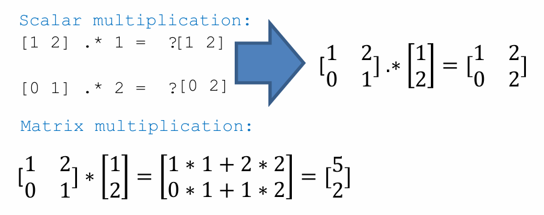
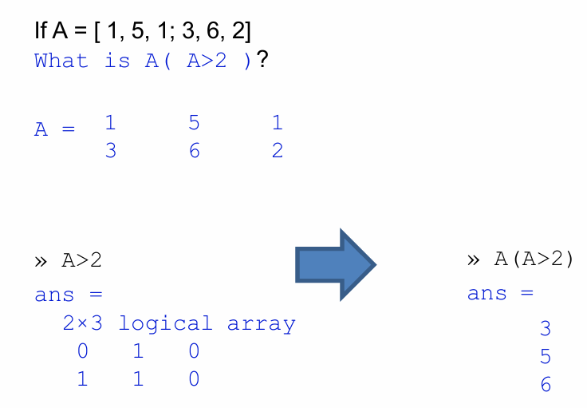
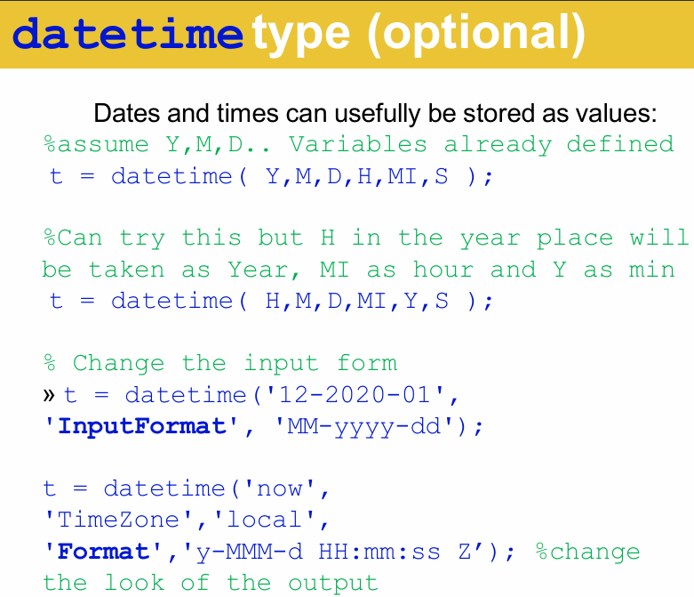
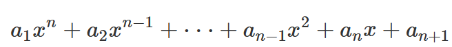
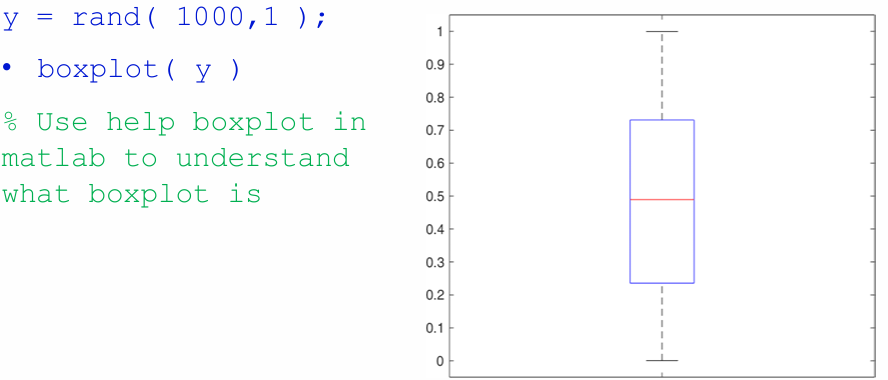
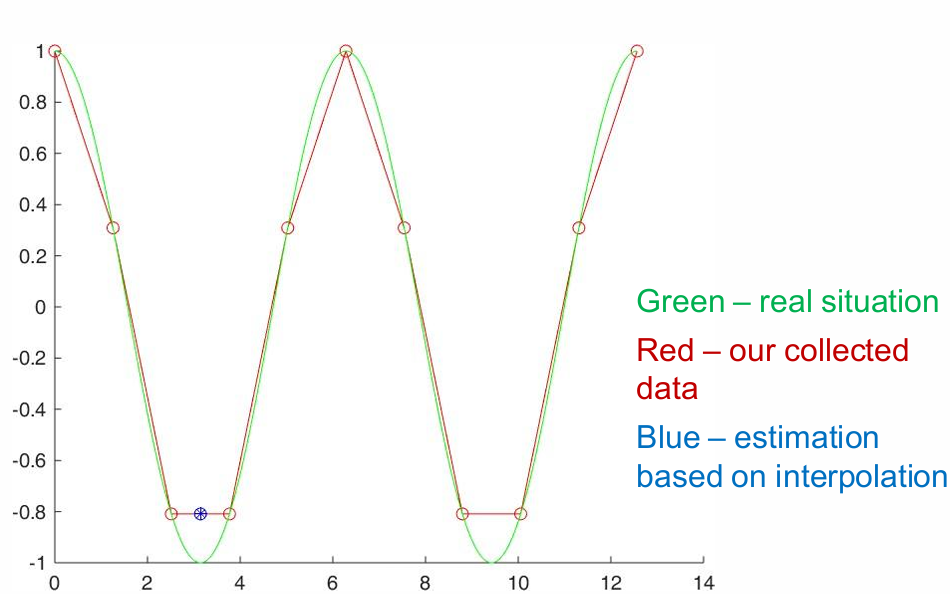
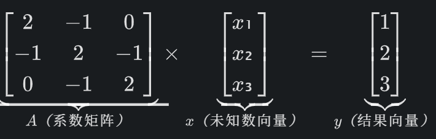
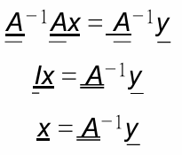
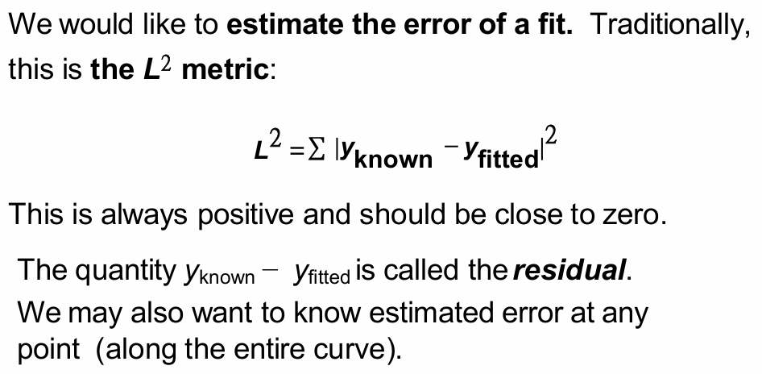

### Some Useful Commands & Types

| Command         | Command       | Command              |
| --------------- | ------------- | -------------------- |
| `doc` or `help` | `clear`       | `clc`                |
| `whos`          | `pwd`         | `home`               |
| `clock`         | `date`        | `quit`               |
| `format short`  | `format long` | `linspace( 0,1,11 )` |
| `sin( pi/2 )`   | `sind( 90 )`  | `logspace( -3,4,8 )` |
|                 |               |                      |

## MATLAB 和 Python 的区别

| Matlab                                    | Python                           |
| ----------------------------------------- | -------------------------------- |
| `a = 4 ^ 3`                               | `a = 4 ** 3`                     |
| `A = [ 1 2 3 ];`                          | `numpy.array([​[1,2,3]​])`         |
| `~=`                                      | `!=`                             |
| `fprintf( 'The number is %s.' , i );`<br> | `print('The number is %s.' %i)`  |
| 末尾输入 `;` 不输出当前语句结果                        | 没写`print`就不输出                    |
| `true` and `false`                        | `True` and `False`               |
| `C:\Users\Desktop\lec\lec23.m`            | `C:\\Users\Desktop\lec\lec23.py` |
| `zeros(3)  >>>生成3*3全零数组`                  | `np.zeros(3) >>>生成3*1全零数组`       |
| `mod(a,b)`                                | `a%b`                            |
`%` 为comment；`#` 为脚本

# Lec22-Intro

## Numeric types

MATLAB numbers **by default** are all `float`s.
`x = 5`时，`x`的类型不是整数，而是*双精度浮点数（double-precision floating point）*

- 即使数值看起来像整数，它在内存中依然占用 64 位（8 字节）。
- 这是为了在科学计算中保持高精度并避免溢出

对于数字，MatLab实现了：

- integers
- floating-point numbers
- complex numbers
in 8-, 16-, 32-, and 64-bit versions (like NumPy).

> [!NOTE] `intN(x)` & `uintN(x)`    (N=8,16,32,64)
> `y_int8 = int8(x);`    % 转换为8位有符号整数（-128到127）  
> `y_uint8 = uint8(x);`   % 转换为8位无符号整数（0到255）
> 浮点数转换：**（不管正负号）四舍五入**
>
> ```matlab
> x = [3.7, -3.7, 2.1, -2.1];
> y_int8 = int8(x);   % [4, -4, 2, -2]
> y_uint8 = uint8(x);  % [4, 0, 2, 0] 负数变为零
>  ```

| **函数**          | **取整逻辑**      | **示例 (2.6)** | **示例 (-2.6)** |
| --------------- | ------------- | ------------ | ------------- |
| `floor()`       | 向负无穷方向取整（地板）  | `2`          | `-3`          |
| `ceil()`        | 向正无穷方向取整（天花板） | `3`          | `-2`          |
| `fix()`         | 向零方向取整（截断）    | `2`          | `-2`          |
| `round()`**默认** | 四舍五入（最接近的整数）  | `3`          | `-3           |

***如果要转的数据大于类型所能承受的数据大小（如 `x_int8 = int8(1000); %1000>127`），则可能丢数据***

`whos` 把workspace的所有变量的类型输出
`whos a` 返回a的类型

## Arrays

```matlab
A = [ 1 2 3 ];  %Python, numpy.array([​[1,2,3]])
B = [ 1 2 3 ; 4 5 6 ];  %Python, numpy.array([​[1,2,3],[4,5,6]])
C = [ 1 ; 2 ; 3 ];
D = [ 1 2 3 ]';  #行列转置 因此 C == D

[ 1 0 ; 0 1 ] * [ 2 2 ; 2 2 ]  % we never show this using numpy (a.dot(b))
[ 1 0 ; 0 1 ] .* [ 2 2 ; 2 2 ] % numpy a*b

eye(M,N)  #生成二维M*N数组，从（0,0）向右下角的对角线为1，其余地方为0

```

> [!NOTE] 矩阵点乘
> 两个数组的**每个对应维度的长度，要么相等，要么其中一个是 1**
> 在兼容的情况下：两个数组会被自动扩展为**2×3 的矩阵**（*取每个维度的最大长度*）
>
> ```matlab
> D = [ 1 2 ]';     %D（2×1）广播为 2×3：`[​[1,1,1]; [2,2,2]​]`；
> x = [ 1 0 0 ];    %x（1×3）广播为 2×3：`[​[1,0,0]; [1,0,0]​]`；
> g = D .* x;
> 逐元素相乘后，g 的结果是：
> [​[1×1, 1×0, 1×0]; [2×1, 2×0, 2×0]] → [​[1 0 0]; [2 0 0]]
> ```



>[!NOTE] Matrix Multiplication
> 在MATLAB中，`*`运算符执行的是**矩阵乘法**（线性代数中的乘法），它要求：
> **第一个矩阵的列数 = 第二个矩阵的行数**

> [!NOTE] 数组的运算符
>
> ```matlab
> A1 = [1 2].*2    >>>[2 4] 
> A2 = [1 2]*2    >>>[2 4]
> C1 = [1 2].+2 -> error 
> C2 = [1 2]+2    >>>[2 3]
> B1 = [1 2].^2   >>>[1 4]
> B2 = [1 2]^2 -> error
> ```

> [!NOTE] Array 的切片
>
> ```matlab
> A = [ 1,2,3 ; 4,5,6 ; 7,8,9 ];
> A(2,:)    >>>[4,5,6]
> A(:,2)    >>>[2,5,8]
> A(2)  >>>4     %竖着数
> %没有像np.array那样两个括号的取法
> ```

## 索引

- ***从1开始，尾端取***
- ***用 `()` 取***
`a:b:c` 从`a`开始，每次加`b`，直到加到`>c`停（不包括*大于* `c`的）
`d:e` = `d:1:e`  即默认步长为1（从`d`开始加1，直到加到`>e`停）

```matlab
1:10
1:1:10  # linspace(1,10,10)
0.1:0.1:0.5
linspace( 1,10,11 )  % np.linspace(1,10,11)
10:-1:1
```

*用 `[]`创造矩阵，用 `()`取索引*

```matlab
A = [0 10 20 30 40 50 60 70 80 90 100]; 
B = A( [ 5,9,2,2 ] );
>>> [40,90,20,20]
```

## Strings

```matlab
msg = 'I am going to miss CS101 during my winter break!';
fprintf( msg );    #也可用 disp？
```

`''` creates `char array` (字符数组)
`""` creates `string`  (字符串) *是一整个元素*

```matlab
s = 'I know this'
bigS = "Different? What? Confused!"   #此时bigS的length为1
s(1) >>> 'I'
bigS(1) >>> "Different? What? Confused!" %返回整个字符串
# 访问字符串内容需要使用花括号，返回字符数组
 bigS{1} >>> 'Different? What? Confused!'
 bigS{1}(1:2) >>> 'Di'
```

## 脚本(Script) & 函数(Functions)

脚本是用文件写成的程序。脚本文件和函数文件均带有后缀 `.m`

```matlab
function [ output1, output2 ] = function_name( input1,input2 )
    % do what you want
end
```

> [!NOTE] 关于 `.m` 文件调用函数的问题
> 一个 `.m` 文件里可以有多个函数，但只有第一个函数(主函数)能从外部访问！
> 第一个函数将通过 `.m` 文件的名称来调用

> [!NOTE] 函数句柄 *类似python中的单行定义函数 lambda*

```matlab
自定义函数：
 f = @(x) x.^2 - 1
 f(-0.5)  >>>-0.75
 
 如果函数是matlab自带的，那么在运行需要调用函数的工具时，前面也要加@
```

## Loops

```matlab
for i = 1:10
    fprintf( '%d haining',i )
end 

for i  = [char array]   #Note: char array is not string
 fprintf( '%d haining',i )
end
```

```matlab
%% loop until condition is met
i = 0;
while i < 10
    i = i + 1;
    fprintf( 'The number is %i.' , i );
end
```

*`continue` 和 `break` 与python中的功能一样*

## Logic

MATLAB does **NOT** have a `bool` data type.
It is called `logical` data type Instead of `True`/`False`, MATLAB uses integers:
`0` means `false`; `1` means `true`
Recognize `false` and `true` and stores as `0` and `1`
MATLAB uses `1` to indicate `True`, `0` to indicate `False`

|             |     |
| ----------- | --- |
| `&` or `&&` | and |
| \|\| or \|  | or  |
| `~`         | not |

> [!NOTE] `ismenber`
>
> ```matlab
> B = [ 1 2 3 4 5 ];
> ismember( 5,B ) 
> >>>1
> ```


***`A(A>2)`按照从左到右从上到下的顺序输出满足条件的元素***

```matlab
if a < 0
    fprintf( 'a is negative.' );
elseif a < 1
    fprintf( 'a is positive, less than unity.' );
else
    fprintf( 'a is greater than or equal to unity.' );
end 
```

> [!WARNING] 判断语句和循环语句**都没有 `:`**

## Random Number Generation (`ml::rand`)

| Distribution     | Sample Commands          | Meaning                                          |
| :--------------- | ------------------------ | ------------------------------------------------ |
| uniform, `(0,1)` | `rand( 5 )`              | 5×5 matrix                                       |
|                  | `rand( 5,1 )`            | 5×1 column vector                                |
|                  | `rand( 1,5 )`            | 1×5 row vector                                   |
|                  | `10 * rand( 3 )`         | 3×3 matrix from `[0,10)`                         |
| integer, [1,n]   | `randi( 5 )`             | number in range `[1,5]`                          |
| **最小值 *最后* 被定义** | `randi( 5,2 )`           | 2×2 matrix with elements from `[1,5]`            |
|                  | `randi( 5,[2 3] )`       | 2×3 matrix                                       |
|                  | `randi( [-5,5],[10,1] )` | 10×1 column vector from `[−5,−5]`                |
| normal, μ=0, σ=1 | `randn()`                | normal random number                             |
|                  | `randn( 5 )`             | 5×5 matrix                                       |
|                  | `randn( 5,2 )`           | 5×2 matrix                                       |
|                  | `10 * randn( 3 ) + 5`    | 3×3 matrix with standard deviation 10 and mean 5 |



# Lec23 - Input/Output

## Save

```matlab
A = [ 1 2 3 ; 4 5 6 ]; 
B = [ 3 4 5 ; 1 2 8 ]; 
```

M1: `save( 'test', 'A' );` %save only `A` into `'test.mat'`
or
M1: `save( 'test');` %save *everything* in the Workspace into `test.mat` Or
M2: Use `save test.txt A -ascii -append`
to append the value of `A` into a file with the name `test.txt`

## Load

`A = load( ’test’, ’A’ );` Load variable A from `text.mat`
 ***更简单的方案：双击文件，变量和值就会导入WorkSpace***
`A = imread( ’myPicture.jpg’ );`  Use `imread` to open `images` (`.jpg`, `.png` or others)  然后用 `image();` 可以输出图片

`dataV = importdata( ’rainfall.txt’ );`
 A more advanced tool （可以处理CSVs,images,etc.）
`importdata('https://zjui.intl.zju.edu.cn/sites/default/files/inline-images/WechatIMG1450.jpeg' );`
***无需`\\`, 只要 `\`就可以***

## Web I/O

`webread` processes data gracefully.

```matlab
url='https://zjui.intl.zju.edu.cn/sites/defa ult/files/inline images/WechatIMG1450.jpeg' 
data = webread( url ); 
image( data );               %display image from an array (DEMO)
```

## Plotting

figure(xxx) creates a new figure (window for plots).

```matlab
x = 0: .1: 2*pi 
y = sin( x ) 
figure(100) %给要创建的图形一个编号 
plot( x,y,’o’ ) 
title( ’sin(x)’ ) 
xlabel( ’x values’ ) 
ylabel( ’y values’ ) 
```

[Other plots to use]:
A. `fplot`- 函数绘图器，无需预先生成数据点，matlab自动计算采样点

```matlab
figure(1) %create a new figure numbered 1 
x = @(t) cos( 3*t ); 
y = @(t) sin( 2*t ); 
fplot( x,y ) % plot a function defined using @(t) 
hold on; %keep the graph when plotting the next
```

B. `plot3`- 绘制三维空间内曲线（曲面要用 `surf` 不考）

```matlab
t = 0:pi/50:10*pi; 
st = sin(t); 
ct = cos(t); 
plot3(st,ct,t) % plot a 3D plot
```

C. `fcontour`- 绘制3D图的等高线

```matlab
figure (2)              %create a new figure numbered 2 
f = @(x,y) sin( x ) + cos( y ); 
fcontour( f ) % plot a contour plot
```

D. `subplot`- small plots within a plot 子图布局管理器

```matlab
x = linspace(0,10); 
subplot(2,1,1); % 2行1列，第1个子图
y1 = sin(x); 
plot(x,y1) 

subplot(2,1,2); % 2行1列，第2个子图
y2 = sin(5*x); 
plot(x,y2)
```

> [!NOTE] Single-line functions
>
> ```matlab
> f = @(t) 3*t;
> f(3) = 9
> ```


# Lec24 - Polynomial



| Polynomial          | MATLAB Representation |
| ------------------- | --------------------- |
| x+1                 | `[ 1 1 ]`             |
| x                   | `[ 1 0 ]`             |
| x^2+1               | `[ 1 0 1 ]`           |
| x^2+x+1             | `[ 1 1 1 ]`           |
| x^4+2x^3+3x^2+4x+5  | `[ 1 2 3 4 5 ]`       |
| 5x^4+4x^3+3x^2+2x+1 | `[ 5 4 3 2 1 ]`       |
| x^6                 | `[ 1 0 0 0 0 0 0 ]`   |

> [!NOTE] `polyval` 用于多项式计算
> `polyval([ 1 2 3 4 5 ], [1,2,3])`     %把x=1和2和3 带入多项式，得出含3个结果的行向量

```matlab
myline = [ 1 1 ];
polyval( myline,1 );  %把x=1带入x^2+1这个多项式里

x = linspace( 0,10,101 );
y = polyval( myline,x );
figure
plot( x,y,'r-' );

myparabola = [ 2 1 1 ];
x = linspace( 0,10,101 );
y = polyval( myparabola,x );

figure
plot( x,y,'r-' );
```

> [!NOTE] 多项式相乘用 `conv`
>
> ```matlab
>
u = [ 3 0 -1 ];
v = [ 2 5 ];
> w = conv( u,v )
>
> ```matlab

> [!NOTE] `polyint` 多项式积分  ***不支持函数句柄***
>
> ```matlab
>
integrand = [ 1 0 -1 0 ];
antiderivative = polyint( integrand );
integral_l = polyval( antiderivative,1 );   %带入端点值
integral_r = polyval( antiderivative,0 );   %带入端点值
> integral = integral_l - integral_r;     %作差求定积分
>
> ```matlab

> [!NOTE] 数值积分 (离散点的积分
>
> ```matlab
> x = linspace( 0,10,11 ); 
> y = [ 0.11 0.09 0.09 0.10 0.11 0.11 0.09 0.10 0.08 0.09 0.11 ]; 
> figure; 
> plot( x,y,’ro’ ); 
> ylim( [ 0 0.2 ] );
> integral = trapz( x,y );     %梯形法数值积分
> ```

> [!NOTE] `polyder` 多项式微分  ***不支持函数句柄***
>
> ```matlab
>
polynomial = [ 1 -1 1 -1 1 -1 ];
derivative = polyder( polynomial );
>
> ```matlab

## 零点与极值

`roots([])`  在多项式中找到根（包括复根），并返回为列向量

`poly()`  取多项式方程的根，然后将其转换回多项式数组
 `poly( [ 1 -1 0.5 ] )`

`fzero()` 寻找一个函数（*不一定是多项式*）的零点

```matlab
f = @(x) x.^2 - 1
or
f = @(x) polyval([1,0,-1], x);  %f要以函数句柄形式封装
a.fzero()
x = fzero( f,x0 )   %一个x0只能得到一个root
```

## Minimize

```matlab
x =-1:.01:2; 
y = humps( x ); % a function available in MATLAB 
xstar = fminbnd( @humps,0.3,1 );              %从[0.3,1] get x-value only 

OR 

[ xstar, ystar ] = fminbnd( @humps,0.3,1 );   %get x- and y-values 
figure; 
plot( x, y, xstar, ystar, ‘ro’ ); 
xlabel( ’x’ ); 
ylabel( ’f(x)’ ); 
grid on;
```

# Lec25 - Basic Statistics

## Statistical quantities

```matlab
rng( 101 );    % seed the random number generator, so the set of random numbers can be always the same. Mostly for troubleshooting.
x = linspace( 0,2*pi,101 )’; 
y = x/50 + 0.002 * randn( 101,1 ); 
figure 
plot( x,y,’.’ );
```

`mean()` 平均数
`medium()`  中位数
`Std()`  标准差

```matlab
x = [1 2 3 4 5];
sort(x,'descend')  >>>[5 4 3 2 1]    %默认是升序(‘ascend’)
```

```matlab
A = [ -5 0 10 ; -3 1 9 ; -4 2 8 ; -1 3 7 ; -2 4 6 ] 
sort( A )    % 每一列从上到下升序(默认)

sort( A, 1 ) % 每一列从上到下升序(默认)

sort( A, 2 ) % 每一行从左到右升序(默认)

sortrows( A, [1] ) % 按每一行的第1个元素(默认为1)重排行 

sortrows( A,3 )% 按每一行的第3个元素重排行
```

> [!INFO] matlab里把新生成的都赋给 `ans` ，因此原变量`A`不变
> ***以上A均不变！***

```matlab
x = [ 1 2 3 4 5 ]; 
sum( x ) >>> ans = 15
cumsum( x ) >>>ans = 1 3 6 10 15    % 求Sn
```

> [!NOTE] `boxplot()`
> 
> 箱体的**底边**和**顶边**分别对应数据的**第25百分位数（Q1）** 和**第75百分位数（Q3）**，箱子中间的标记（一条线或一个符号）代表**中位数**

## Interpolation 插值法

`interp1(x,y,x0,[type])`  %默认为 `linear`，用线段穿过每两个数据点
 ***注意，`interp1()` 是数字 `1`不是字母小写 `l
 type 有`linear`(default) ,`nearest` , `pchip` / `cubic`这三种***

```matlab
x = linspace( 0,1,11 ); 
y = x .^ 2; 
plot( x,y,’ro-’ ); 

% Get value of y at x_est 
x_est = 0.15; 
y_est = interp1( x,y,x_est ); 
hold on;
plot( x,y,’ro-’ );
plot( x_est,y_est,’bo’ );
```



`nearest` 使用实际数据中最接近所需x点的x值来获得y估计值 *如果是 .5，则往左取*

`pchip` / `cubic` 在**每两个相邻已知点之间**构建一个三次多项式（除了两个数据点，还用到了这两个端点的**导数**（由更多点计算而来），4 个条件锁定 4 个参数，才得到**唯一**的三次多项式）

## Matrix Equations

### 定义

> [!NOTE] `A*x = y`
>
> - `A`：系数矩阵 → 把所有方程的 “系数” 按规则排成表格（比如 2 个方程的系数就排成 2 行）；
> - `x`：未知数向量 → 所有要解的未知数（比如 x₁、x₂、x₃）排成一列；
> - `y`：结果向量 → 所有方程等号右边的数值（比如 1、2、3）排成一列。



### 解法

#### 1.逆矩阵法 （`x = inv(A) * y`）——类比倒数求解 **缺点：效率低**

矩阵里没有 “除法”，但有类似 “倒数” 的东西叫 **逆矩阵**（记为 `A⁻¹`），满足：`A * A⁻¹ = I`（`I` 是单位矩阵，相当于矩阵里的 “1”）

所以对矩阵方程 `A*x = y` 两边同时乘 `A⁻¹`：


```matlab
A = [2 -1 0; -1 2 -1; 0 -1 2];  % 3行3列，对应3个方程的系数
y = [1; 2; 3];                   % 3行1列，对应方程右边的结果

% 用逆矩阵求解
x = inv(A) * y;  % inv(A) 就是求 A 的逆矩阵
```

#### 2. 左除法（`x = A \ y`）——MATLAB推荐，更高效  

## Time Code

`tic; [operation]; toc`

# Lec26-Polyfit

Given `n+1` number of `( x,y )` points (or more), we can fit a nth order polynomial as a possible curve.
`polyfit(x,y,n)`
`p = polyfit(x,y,n)`  **得到从左到右an到a0的n+1个元素的行向量**

```matlab
%generate our x and y data 
x = rand( 5,1 ); y = rand( 5,1 ); 

%generate our fit 
xf = 0:0.01:1; 
pf1 = polyfit( x,y,1 ); %linear regression (线性回归模型)

pf3 = polyfit( x,y,3 ); %cubic 

%Plot our fit 
yf1 = polyval( pf1,xf ); 
yf3 = polyval( pf3,xf ); 
hold on 
plot( x,y,’ro’, xf,yf1,’b-’, xf,yf3,’k-’ );
```

```matlab
% we can ask for input from user 
n = input( ’Give a polynomial order’ ); 
x = rand( n-1,1 ); 
y = rand( n-1,1 ); 
xf = 0:0.01:1; 
n1 = n              %the polynominal order you want to fit 
pf = polyfit( x,y,n1 ); 
yf = polyval( pf,xf ); 
plot( x,y,’rx’, xf,yf,’r-’ ); 
```

*If n > 点的数量, MATLAB 报错:
 ‘Polynomial is not unique’*

**n不能太高，否则会为了过所有点而 overfitting ，图像会失真**

## Estimate the Error of a Fit



**A good fit has a small residual**

## Another Interpolation — Spline

Splines 分段多项式，旨在平滑地拟合长段而不会过度拟合
Splines 通常由三多项式构成。 类似 `interp1()` 中的 `pchip`
**一定过所有点，因为就是取点来表示函数的**

`y_est = spline(x,y,x_est);   %x_est => x-points you want`

**overshoot（过冲）**
**underfitting（欠拟合）**
