# Python

## Lec1 & 2
>
> All data are stored as binary(二进制)

**Bit or Byte**
1 bit = 0/1
1 byte = 8bits

- Expressions and Statement 表达式和语句  `4/2`  `import math`
- Operators 运算符号 ` +=*/ `
- Variables 变量 `x=5中的x`
- literal 字符 `x=5中的5`
- comment 标注 `#balabala`
- keyword 关键字 (35个) `['False', 'None', 'True', 'and', 'as', 'assert', 'async', 'await', 'break', 'class', 'continue', 'def', 'del', 'elif', 'else', 'except', 'finally', 'for', 'from', 'global', 'if', 'import', 'in', 'is', 'lambda', 'nonlocal', 'not', 'or', 'pass', 'raise', 'return', 'try', 'while', 'with', 'yield']`

### 类型

`type()` 反馈变量或字符的类型

- int
- float
- str
 **注意，`'ab'[0]`是`TypeError`**
- complex
 **注意！`0+1j`中，0和1均为float型**
 对于 complex 型的 c=4+2j，`c.real` 为实部，`c.imag` 为虚部

```
x = complex("5.1 - 4.4j") -5
print(x)
>>> Error!

(1 + 4j).conjugate() #求共轭复数 *这里可以有空格！*
```

> [!NOTE] `complex()`用法
>
> ```python
> complex(real=2, imag=3)  >>>(2+3j)
> complex(3,4)  >>>(3+4j)
> complex(10)  >>>10+0j
> complex("4.1+3.9j")   >>>(4.1+3.9j)
> ```
>
> *括号中不能有空格，否则为error无法转化*
> *`j`表示数学中的复数 `i`，大小写注意！*

### 占位符

```python
x = 65
print("%f" %x)
>>>65.000000 默认六位小数
print("%.2f" %x)
>>>65.00

print("%c" %x)  x为ASCⅡ码，返回对应的值
>>>A

print("%s" %x) or "%d" or "%i"
>>>65

print("The skyscrapter %s has a height of %f m" %(building,height))
#可以连续使用多个占位符，用括号

b = '2025-%s' %"New Start"
print(b)
>>>2025-New Start 
#已经是字符串了，不用转换，但是起到占位符用法，没有一点问题！！！
```

> [! INFO] 1.返回的均为str格式！因为print只输出str格式，但是print括号内的可以是float和int
> but：
>
> 1. `%s`：用于格式化字符串（string）。它可以接受任何类型的对象，并自动调用对象的`str()`方法来获取字符串表示。如果传入的不是字符串，它会尝试将其转换为字符串。
> 2. `%d`和`%i`：这两个都用于格式化整数（integer）。在大多数情况下，它们可以互换使用。它们要求传入的对象必须是整数，或者可以被转换为整数（例如，浮点数会被**截断**为整数）。如果传入的对象不能转换为整数，则会抛出异常。

> [!NOTE] 2.关于 `print()`的逗号在输出时自动转化为空格，a可以不是str

```python
a=18
print("我的年龄:",a)
>>>我的年龄: 18          #18前有一个空格
```

`str.title()` 把文本中的每一个**词首字母**大写
`str.upper()` 把文本中的所有字大写
`str.lower()` 把文本中的所有字小写

### 关于math库中的 `log()`

`from math import log` or `import math   math.log`
> `log`的默认底数为e, 更完整的是 `log(x,base)` 即底数在后

## Lec3 - if and loops(for & while)

```python
a = input( 'Enter a number:' )
```

***a是str, 不能直接和数字比较，要`int()`***

## Lec4 - list

`let x = [1,2,3,4]`
`del x[1]` 删除**索引**为1的元素，后面补上
`x.sort()`  把列表x升序排序
> [!NOTE] 关于`.sort()` 和 `sorted()`
> **.sort()**
> 升序排序后返回None，但x自身已经排序完成
> 也就是 `x = x.sort()` 后，x为None
> ***`.append()` 和 `.reverse()`同理***
> 括号中为 `reverse = Frue` 时降序排序，不填时默认为False（升序）*`sorted()` 同理*
> 括号内可以选取排序的参考对象，见[[#^6244d2]]中的`lambda`
> **sorted()**
> 返回升序排序后的结果
> `b = sorted(a, key = lambda s: s[1], reverse = True)`            *s为元组*
> 可以对列表、字符串、元组、字典排序
> **当对字典的键值对排序时，要用`.items()` 获取键值对**

`x.index( element )` 找到x中第一个出现的element的索引
> [!NOTE] 关于index和find
> 均只能找到的第一个所求str[的首字符]出现的索引
> index可用于str和list；但是**find只能用于str**
> 但是index找不到时直接报错返回error；find找不到时**返回-1**
>

`enumerate(x[,start=0])` 返回以`(索引，值)`为单个元素（tuple元组）的列表   *start默认为零*
**它返回的是一个枚举对象，无法直接被print；但可以通过`list()`转换或loops来获取元组**
> [!TIP] `zip()`同理无法直接被print [[#^2f6664]]

`replace(str1,str2)` 把`str1`换成`str2`

`.strip()` 默认是把str首尾的空格和 `'\n'` 全部删除，但当括号内有另外的str1时：

```python
a = "absjiodjfdincabbba"
a.strip("ab")
>>>'sjiodjfdinc'   #str的首尾凡是出现在str1中的字符均会被删除，不论个数、顺序！
```

`.isdigit()`, `.isalpha()` 前的字符串，***不能***含有空格
`.islower()`, `.isupper()` 前的字符串，***可以***含有空格
`.isalnum()` 用于检查字符串中的字符，是否 *全是* 字母或数字 （字符串 *有* 空格则返回`False`）

`sum(list)` ：`list`里所有元素均属于`int`或`float`或`complex`时，求和    **否则为`TypeError`**

```python
r = [ 2,2 ]
x = r * 2
print(x)
>>>[2,2,2,2]   #相当于Matlab中的点乘
```

## Lec5 - Functions

*错题反省*

```python
def dec(x = 2, y = 1):
    return x + y
y = z = 0
y = dec(2, 2) * dec() + dec(1) * dec(y = 2.5)
print(y)
```

`dec(2,2)` 为`x=2,y=2`
`dec()` 为按照默认值`x=2,y=1`
`dec(1)` 为`x=1`, `y`用默认值1 ***(当只提供一个未指定的参数时，Python 会将其分配给第一个参数)***
`dec(y=2.5)` 为`x=2,y=2.5` y为指定参数赋值，x则用默认参数

> [!NOTE] 函数参数赋值的其他注意点
> dec里的参数为 `x` 和 `y` ，那么后面的操作中就不能出现 `dec(t=1)` 否则报错

`lambda` 和 `def` 的作用类似，只不过是在一行内定义函数，如： ^6244d2

```python
xxx = lambda a : a+8 
print(xxx(5))
>>>13

z = ['ab','bc','ca']
z.sort(key = lambda a:a[1]) #这里a为z中的元素，临时定义的变量
print(z)
>>>['ca','ab,'bc']
```

^4f0a7f
> [!WARNING] 关于函数局部变量的问题  
> 函数执行完毕后，其局部命名空间就会被销毁。全局作用域不会保存局部工作区的变量
> 这个时候如果试图从函数外部访问函数内部的变量，就会引发 `NameError`

## Lec6 - Files

1. Open the file to read/write

- 方法一：`myfile = open('words.txt','r')`  "r"为读取；"w"为编辑（write）*不写就默认是r*
 **结尾加 `myfile.close()`**
- 方法二：`with open( 'words.txt' ) as myfile:`

> `open()` accepts two values of type **`str`** as arguments and returns a value of type **`file`**.  

> [!NOTE] 关于读取文件路径
> 如果只有文件名，则文件处在代码相同的位置
> 否则则需要定位：
> `'C://users//Edwin Jing//Desktop//words.txt'`
> **1. 可以用\替换/
> 2. C盘后必须跟两个斜杠**

`'\n'` - newline   *单纯光标向下一行，列不动*
`'\r'` - carriage return   *光标回到最左侧*
 `print(Hello\rYou)   >>>Youlo`
 **`Hello`已经打好了，但是输出`You`之前光标又回到最左侧，所以`Hel`被覆盖了**
`'\t'` - tab
`' '` - space

1. 从内存中读取数据
`mydata = myfile.read()` 全读并返回str            *包括`'\n'`*
`mydata = myfile.readlines()` 以 `\n` 为分隔符，返回列表，每一行str为一个元素
    *元素末有 `'\n'`*

2. Close the file
`myfile.close()` **关闭的不是读取的数据，而是open的文件**
3. Use the data

`a = a.split(',')`  split()是不能对*list*操作的，只能对*str*操作

```python
a = " ZJUI is ZJU "
list = a.split(" ")
print(list)
>>>list = ['', 'ZJUI' , 'is' , 'ZJU' ,'']
```

> [!ABSTRACT] `split()`相当于遍历字符串找到空格，然后把空格前和空格后切开
> 这里ZJUI前的空格左边没有其他字符了，所以list的第一个元素就是空（``），最后一个元素同理

`.join(list)` 点前为要使用的连接符号（`' '`最常用），括号内为初始列表
把列表中的元素用连接符连接并以str形式保存

```python
my_list = ['I','Love','You']
a = ' '.join( my_list ) 
print(a)
>>>I Love You
```

`zip()` 同时遍历 / 使用两个==相同长度==的列表
**当可迭代对象长度不同时，以最短的为准（多余的被舍弃）**

```python
letters = [ 'A','B','C','D' ]
numbers = [ 1,2,3,4 ]
for letter, number in zip( letters,numbers ):
    print( '%s pairs with %i' % ( letter,number ) )
```

***`zip()` 和 `enumerate()` 一样，它返回的是一个枚举对象，无法直接被print；但可以通过`list()`转换或loops来获取元组*** ^2f6664

### How do we read a `.csv` into python?

假设一个csv文件：
 name, age, city
 Alice, 30, New York
 Bob, 25, Los Angeles
 Charlie, 35, Chicago
Method 1：

```python
myfile = open('cafePrice.csv') 
rows = myfile.readlines() 
for row in rows: 
 print( row.strip() ) 
myfile.close()
```

Method 2：

```python
import csv
with open('data.csv', 'r') as file:
    reader = csv.DictReader(file[, fieldnames=['name', 'age', 'city'],delimiter=',']]) # 假设文件没有标题行，我们指定列名;delimiter默认是逗号，是csv文件的分隔符
    for row in reader:   #reader的类型是csv.DictReader，可以用for来遍历（但只能遍历一遍）；也可以用list()转换成列表以允许多次遍历
        print(row)
>>> {'name': 'Alice', 'age': '30', 'city': 'New York'}
 {'name': 'Bob', 'age': '25', 'city': 'Los Angeles'}
 {'name': 'Charlie', 'age': '35', 'city': 'Chicago'}
 
reader.fieldnames  # 列名列表
```

> [!NOTE] DictReader 的特点
>
1. **自动使用第一行作为键**
2. **每行返回一个有序字典（OrderedDict），这些有序列表被容纳在一个列表里**
3. **通过列名而不是索引访问数据**

## 示例

## **Lec7 - Mutability（可变性）**

`id()` 返回对象内存地址，在对象生命周期内通常不变
约等于 `is` （比较内存地址是否相同）
*除了 `b = a` 这种，其他的（例如 `c = a[:]`）都叫复制，id不同*

`list`，`dictionary`，`ndarray` 是mutable（有alias，例如`b = a` b就是a的别名)

```python
x = [1,2,3]
y = x
y[0] = 6
print(x)
>>>[6,2,3] #因为x是list，是mutable，而y和x的id是一样的，因此改变y也就改变了x
--------------------------------------------
dic1 = {'1':1,'2':2}
dic2 = {}
x = list(dic1.keys())
for n in range(2):
 dic2['c'] = n
 dic1[x[n]] = dic2
print(dic1)
>>>{'1': {'c': 1}, '2': {'c': 1}}              #而非{'1': {'c': 0}, '2': {'c': 1}}
#因为dict是mutable，所以dic1的两个键最后指向的都是dic2的id，所以dic2最终是什么就输出什么；
#只有将dic2每次循环都重置（移到循环里），才能让id变化
```

`str`，`int`，`float`，`complex`是immutable（*无 alias*（假名））

**Tuple （元组）**
***有序且不可变***
`a = (1.0)` 为浮点数
`a = (1.0,)` 为元组

## Lec8 & 9 - Dictionary

Let `dic = {'one': 1, 'two': 2}`
`dic.clear( )` 清空字典中的所有键值对
`dic.get( _key_ )` 得到dic中特定键对应的值       (e.g. `dic['Two']` => `2`)

| 特定条件下的区别 | `dic[ 'two' ]` | `dic.get( 'key' )` |
| -------- | -------------- | ------------------ |
| 键不存在时：   | 抛出 `KeyError`  | 返回 `None` 或默认值     |

`for i in dic:` 中， **`i` 是键**
`dic.items()` 是键值对               键值对（entry）
`dic.keys()` 是键
`dic.values()` 是值

任何**immutable**的类型均可成为`key`
> mutable的类型（`list`和`dict`和`ndarray`）不行

> [!INFO] 字典的key最好独一无二，如果出现重复，后面的会把前面的**覆盖**掉
>
> ```python
> dic = {'one': 1, 'one': 2}
> a = dic['one']
> print(a)   >>>2
> ```

## Lec10 - NumPy

numpy提供数组和矢量化运算 - 而list只能逐个元素进行操作

`import numpy as np`

```python
data = np.loadtxt( 'inflammation.csv',delimiter=',' )

x = np.array([​[1, 2, 3], [4, 5, 6]])
print(x.shape) 
>>>(2, 3)    #元组
```

**Indexing**

```python
#取第一行第二列的元素
mysquare[ 1 ][ 2 ]
mysquare[ 1,2 ]   # cannot be done by `list`
```

> [!INFO]  **`:`表示全部**

```python
mysquare = np.array([​[0, 1, 2], [3, 4, 5], [6, 7, 8]])
mysquare[:,1]  >>> [1 4 7]
mysquare[:][1]  >>> [3 4 5]  #这里的[:]由于在前面，对mysquare没有任何影响，相当于取了mysquare全部，后面跟的[1]则依旧从行开始
mysquare[1,:]  >>> [3 4 5]
mysquare[1][:]  >>> [3 4 5]
mysquare[ 0:2,0:2 ]  >>> array([​[0, 1],
           [3, 4]])
```

> [!WARNING] **NumPy Array 是 `ndarray` , 是mutable**

**Convenient Functions**

```python
np.zeros( [shape=]( 3, ) )  #生成3*1的全 0. 列数组  
 or np.zeros( [shape=][ 3, ] ) 
np.zeros([3])  >>>[0. ,0., 0.]
 or np.zeros( 3 )  #这种单层括号的只能生成n*1的，np.zeros(3,2)是会报错的
     #且输出的是[0. ,0., 0.]是浮点数，后面跟上dtype=int 才是[0,0,0]
np.ones( ( 4,3 ) )  #生成4*3的全1数组   # 和zeros同理
np.eye( 4 )  #生成二维4*4数组，对角线为1，其余地方为0   # 只需且只能有一层括号
np.eye(4,3)  #生成二维4*3数组，从(0,0)向右下角的对角线为1，其余地方为0  #只能有一层括号
mysquare.T          # 行列转换; 但不改变mysquare，可以赋值给别的变量
mysquare.tolist()  #转换array为list
mysquare * mysquare # 数组元素求平方 （并非矩阵）
mysquare.dot( mysquare )    # 作为矩阵平方
x.max() 或 np.max(x)    #整个矩阵的最大值  
x.max(axis=0) 或 x.max(0)        #每列的最大值  
x.max(axis=1) 或 x.max(1)     #每行的最大值
mysquare.mean(1)  #按行算平均   0为按列算平均  返回的元素均为float
```

> [!NOTE]- `np.shape()` 获取行列数尺寸 <--> `np.size()`获取元素数目
> 对MATLAB而言，`size()`获取行列数尺寸<-->`numel()`获取元素数目

> [!INFO] 如何理解括号内是否还要放括号来确定矩阵大小？
> 事实上，需要两层括号的函数往往获取多个参数，因此如果不严加括号限定，就会让逗号暴露在外，让参数的定义不明确
> 例如，`np.zeros(shape, dtype=float, order='C', *, like=None)`获取这么多参数，如果在shape处不加小/中括号，原本代表尺寸行列区分的逗号就会被用于分配参数，就会导致***`TypeError`***
> 关于这一点，[[#Lec13 - Random （实际上并非随机，用函数生成的）]]中的 `size()`也是同理

> [!NOTE] 关于NumPy中的`.sort()`和 `.argsort()`

```python
mysquare.sort()     #默认括号里是1（把每一行升序排序）; 返回None，但是改变mysquare
mysquare.sort(0)  #把每一列从上往下升序排序
a = mysquare.argsort()  #相比于sort，执行后mysquare不变，而是返回索引，告诉你怎么排序
```

`np.linspace(st,ed,num[,endpoint=Ture,retstep = False])` 把`[st , ed]`这个区间分为num个数，并且以一维数组 `ndarray` 返回
默认`endpoint = Ture`（ed要取）；`=False`时不取
默认`retstep = False` 即不返回另外一个存储步长的变量

`np.linspace(1, 10, 10)` >>>  `array([ 1.,  2.,  3.,  4.,  5.,  6.,  7.,  8.,  9., 10.])`  ***都是float***

**Data Type——用 `.dtype` 来查看**

- `bool` (regular Python `bool`)
- `int64` (regular Python `int`)  针对64位系统
- `float64` (regular Python `float`)
- `complex128` (regular Python `complex`)

`x = np.array([1,1,0,1,0])`
`( x == 1 ).any()   >>> True`
`( x == 1 ).all()   >>> False`

## Lec11 - Plot

`import matplotlib.pyplot as plt`

`plt.plot(x,y,color = "blue",linewidth = 1.0,linestyle = '-',label='')`
or `plt.plot(x,y,'b-',label = '')`
`x` 和 `y` 均为列表，且元素个数要对应；元素个数不对应则报错（ValueError）

`plt.xlim(a,b)` 和 `plt.ylim(a,b)` 分别表示图标坐标轴的范围

- `plt.title("")`
- `plt.legend([loc='best', frameon=False])` (使用了 `label` 时，接上 `plt.legend()` 才会显示)
 `frameon`参数反映图例是否有边框，默认为`True`
- `plt.xlabel("")`
- `plt.ylabel("")`
- `plt.xticks(np.linspace(...))` 显示x轴刻度，y也一样
- `plt.imshow()` 显示二维数组为一张照片，按灰度值显示 <--> `plt.plot()`单纯显示函数图线
- `plt.savefig("xxx.png",dpi = 72)` 以每英尺72像素保存图像为png格式

***plotted line*** 指图像

| Color       | String | Marker Type    | String |
| ----------- | ------ | -------------- | ------ |
| Red         | `'r'`  | Solid line实线   | `'-'`  |
| Green       | `'g'`  | Dashed line虚线  | `'--'` |
| Blue        | `'b'`  | Circles 大圆     | `'o'`  |
| Black       | `'k'`  | Dots 小点        | `'.'`  |
| Magenta 洋红色 | `'m'`  | Crosshatches 叉 | `'x'`  |
| Yellow      | `'y'`  | Crosses 加号     | `'+'`  |
| Cyan 青色     | `'c'`  |                |        |

> [!INFO] 多条图像的绘制
> `plt.plot(x,y1,'b-',x,y2,'k--')` 可以实现 `y1` 和 `y2` 两条曲线的绘制

## Lec12 - State

### Finite Differences 有限微分

- PROBLEM: 明确问题和相关的约束；如果问题过大，需要被分解为可以测量的问题
- MODEL DEFINITION：包含物理和数学公式，限制条件，生成代码来实现模型

> I) (First order) *Forward* difference, Python: v[n]= (y[n+1] – y[n]) / (t[n+1] - t[n])  选新的那个
> II) (First order) *Backward* difference, Python: v[n]= (y[n] – y[n-1]) / (t[n] - t[n-1]) 选老的那个
> III) 用数学、物理函数建模

- CALIBRATION：
>
> - Verification(核实): 检查是不是解决的是所需求的问题
> - Validation(验证): 检验问题是不是成功解决           *在代码中就是(带入一些数据)运行一遍的意思*
>
- APPLICATION: 得到一些反馈
- EXTENSION：修正、完善       ***相比较于先前的函数模型而言***

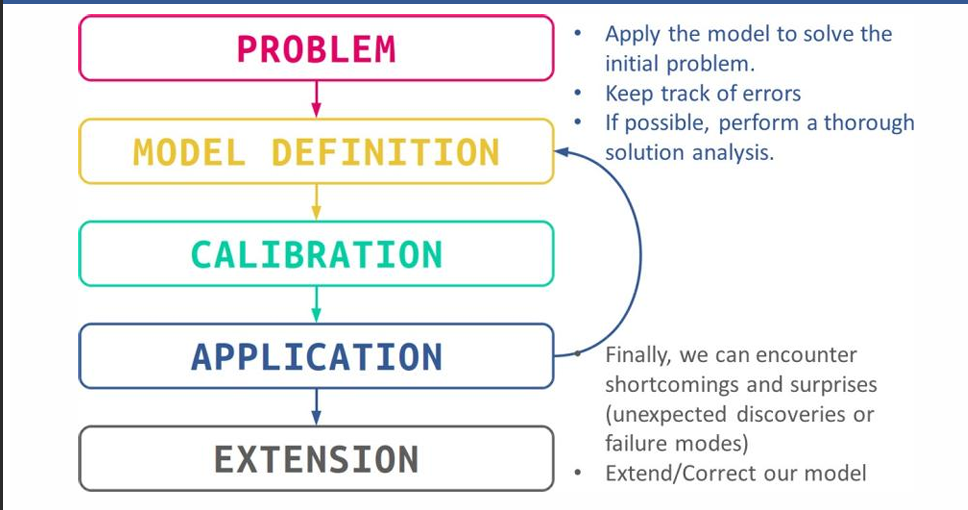

## Lec13 - Random （实际上并非随机，用函数生成的）

### 均匀分步 Uniform Distribution

生成1000个在`[0.0, 1.0)` 范围内的均匀分布随机*浮点*数
`numbers = np.random.uniform(size=(1000,))`  Or `np.random.rand(1000)`

指定范围 `[low, high)`
`numbers = np.random.uniform(low=1.0, high=5.0, size=(1000,))`
 *`rand`不能指定范围，只能`[0,1)`*
 生成二维数组
`matrix = np.random.uniform(size=(3, 4))`  # 3行4列的矩阵
Or `np.random.rand(3,4)`

### 正态分布 Normal Distribution

`numbers = np.random.normal( size=(1000,) )` 返回标准正态分布（平均值为0，标准差为1）

要模拟平均值为 10.0、标准差为 2.0 的随机分布：

```python
mean = 10.0
stdev = 2.0
np.random.normal( size=(100 ) ) * stdev + mean
```

### 离散分布 Discrete Distribution

`numpy.random.randint([low=0,] high [, size=(,), dtype=int])`
 **high一定要大于1，且不包含其截断小数的那个整数**
 但是，btw，由于python中小数点有不精确的问题，1.9999999999...也可以被视为2

`size = (10,)` 生成10个数； `size = (2,3)` 生成2行3列数组；如果为`None`，则只生成一个随机整数

> [!NOTE] 关于 `shuffle` 洗牌
> `np.random.shuffle(list)` 将一个序列（如数组）的顺序随机打乱。
> **注意：
> `shuffle`会直接修改原始数组，而不是返回一个新的打乱后的数组
> 如果是多维数组，只会在第一维（行）上进行随机重排**

```python
deck = list( range( 52 ) )
np.random.shuffle( deck )
```

> [!NOTE] 关于 `choice`
> `np.random.choice(a, size=None, replace=True, p=None)`
> 从给定的一维数组或序列中随机抽取元素。可以指定抽取的数量、元素被抽取的概率以及是否允许重复抽取
> **有返回，且不改变`a`**
>
> - **a**：如果是一维数组，则从中抽取元素；如果是整数，则从`np.arange(a)  >>>[0,1,2,...,a-1]`中抽取。
> - **size**：输出数组的形状（默认为None，返回单个值）
> - **replace**：布尔值，是否允许重复抽取（默认为True，即允许放回再被抽）。
> - **p**：与a相同长度的概率数组，指定每个元素被抽取的概率（默认为等概率）。

### Histograms 直方图

**对于均匀分布，堆栈将具有相同的高度或接近高度**

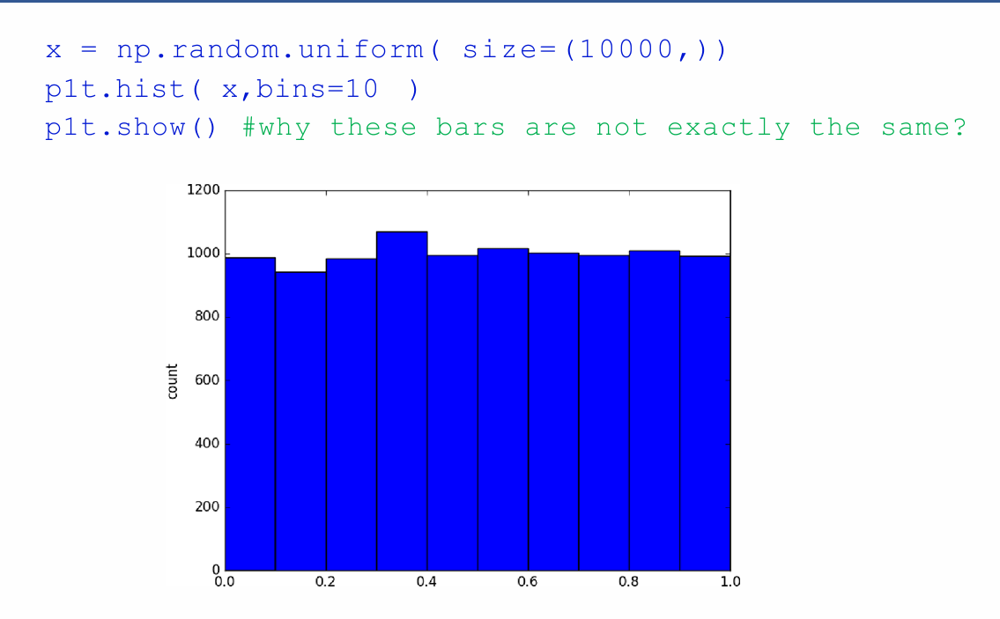

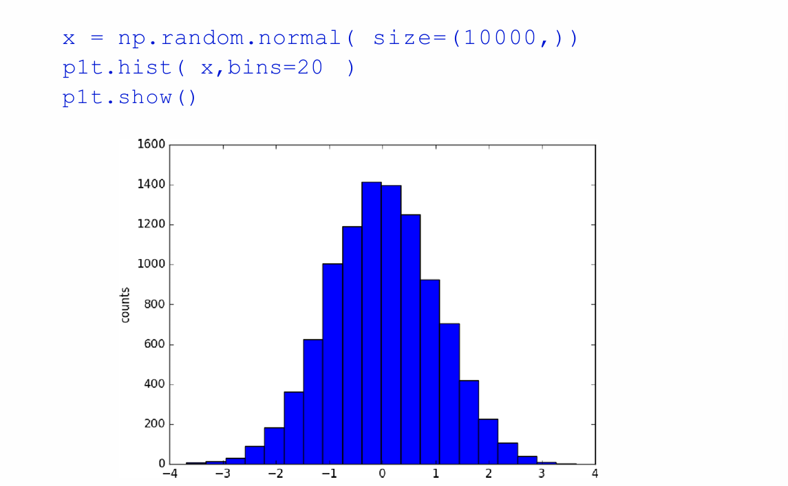

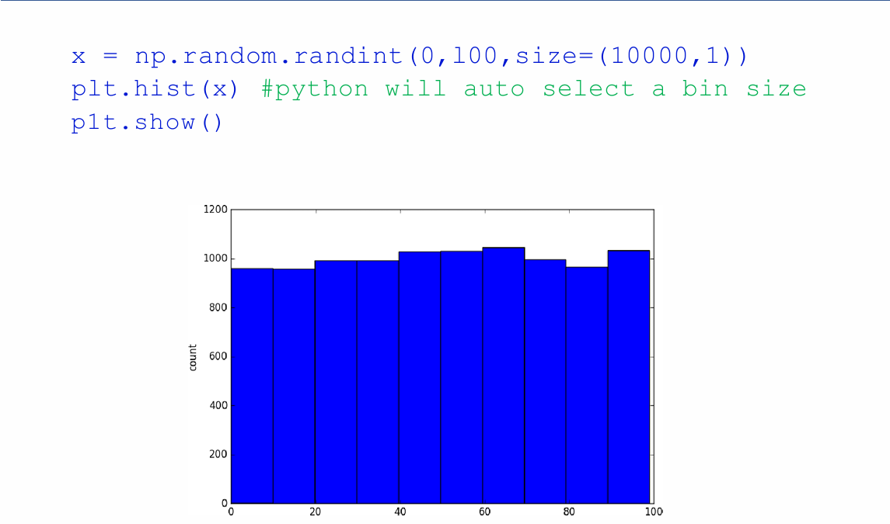

evenly distributed: 均匀分布

## Lec14 - The Data Pipeline

**Input** 的三个来源:

- 用户：通过`input()`.
- 硬盘驱动器（电脑上的文件）： 通过 `open` or `csv`.
 ***`csv` 指comma-separated values(逗号分隔值)：用逗号分隔不同的值，通常用于表格数据的存储和交换。***
- 互联网：通过`requests[.get(url,verify = True)]`. 为`False`(default)时绕过验证过程
 *要 `import requests`*

```python
import requests
rdata = requests.get( 'https://www.github.com/' )

rdata = requests.get( 'http://samplecsvs.s3.amazonaws.com/Sacramentorealestatetransactions.csv' )
```

> [!NOTE] 关于`request.get()`
> `rdata` 类型*不是str！而是 `requests.models.Response`(知道即可)*
> 因此需要 `rdata.text` 来获取字符串

**Output** can be of several types:

- 文本形式, via `print`.
- 图标, via `pyplot` (in `num/plotting`).
- 文件, via `write` or a similar tool.

## Lec15 - DEBUG

### **Bug**：包括 `exception`、`error` 、逻辑错误，模棱两可或不正确的代码

### **Error（错误）**: 导致程序不能执行的异常（且不能在运行时被解决）

==“Python不喜欢你的结构”==
在运行前会分析词法和语法，如果token的排序不符合Python的语法规则，解析器立即停止，并且抛出`Syntax errors`：

- 括号不匹配
- 遗漏\错用标点符号
  - 判断句中的`==`打成 `=`
  - 遗失冒号
- 关键字误用：`def = 5`                *35个 Keywords 被当做变量*
或 抛出`IdentationError`：
- 缩进错误
- Tab和空格混用（没见过）

### **Exception（异常）**: 任何其他错误都是异常。它们是在运行过程中发现的不寻常行为，尽管不一定是意外的

==“Python喜欢你的结构，但是没逻辑的内容让它匪夷所思”==

- `NameError`：在当前工作区（命名空间）找不到对应的变量
  - 拼写错误（大小写敏感）
  - 在赋值前就尝试读取
  - 试图在函数外部访问函数内部的变量               见[[#^4f0a7f]]
- `TypeError`：操作或函数应用于*不合适的数据类型*
  - 数学运算的类型不兼容（字符串和int之间的加法）
  - 不可调用对象（`int`的切片，`len(5)`给整数取长度）
  - 不可迭代对象（`for i in 100:` for需要一个序列如列表或字符串而不是一个整数为容器)
- `ValueError`：操作或函数接收到了*类型正确* 但*内容不合适* 的参数
  - 类型/进制转换失败（`int("Hello World")`可以接受字符串类型的转换，但内容不被接受)
  - 数学领域违规（`math.sqrt(-1)  #要cmath才行`)
  - `.index()`找不到
  - 解包时数量不匹配 `a, b = [1, 2, 3]`
  - 无中生有 `open(filename,'k')` 只有r,w,a而没有k
- `IndexError`：索引超出序列范围
- `KeyError`：字典中没有对应的键值对时
 用`dict.get()`方法避免报错，就像用`find()`来避免`index()`找不到会报错一样
- `ZeroDivisionError`：除以0
- `FileNotFoundError`：检查文件是否存在
- `AssertionError`：出现在 `assert` 后的条件不满足时

```python
try:
 #the main code
 #if an error occurs, it goes into "except:"
except (errortype1):
 #an error occurs, usually print something
except (errortype2)：
 #print other things
...
else:
 #if no error, then run this
finally:
 #Whether error or not, run this finally
```

### 浮点数的比较

```python
a = 0.1
b = 0.2-0.1
a == b
>>>True

a = 0.2
b = 0.3-0.1
a == b
>>>False
```

***由于大部分浮点数的二进制存储是无限循环，因此会出现精度问题***

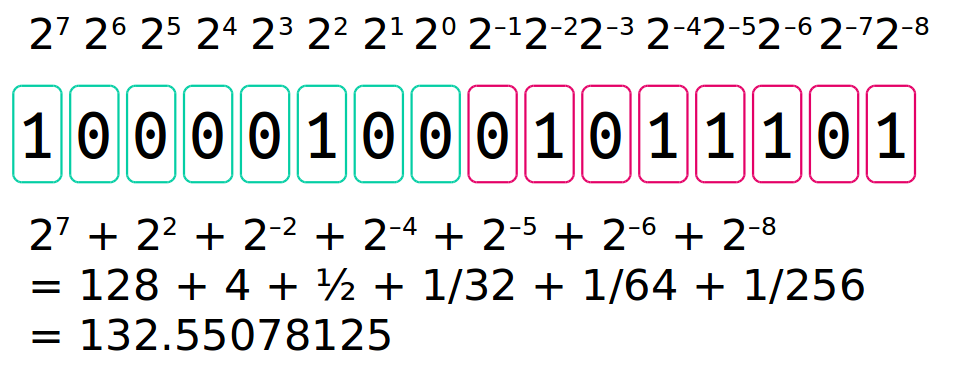

***二进制0舍1入***

```python
np.isclose( a, b, rtol=1e-05, atol=1e-08)
 #逐个比较a和b中的对应元素，返回一个等元素个数的列表，包含True和False
np.allclose(a, b, rtol=1e-05, atol=1e-08)
 #逐个比较a和b中的对应元素，找到一个不接近的，就返回False，否则返回True（只返回一个）
```

## Lec16 - Equations

```python
t = sin(x)
y = a*t**3 + b*t**2 + c*t + d  #这样比直接用sin(x)效率高的多，快了三倍！
```

`%timeit -n 10 f(x)` 可以比较函数运算的快慢  *要先 `import timeit`*

1. 在每个计时循环中，连续执行 `f(x)` 10次
2. 测量这10次执行的总时间
3. 计算平均每次执行时间 = 总时间 / 10
4. 报告最快循环的平均时间

> x很大时，递归函数比表达式函数慢

`import scipy.optimize`

```python
> xstar = scipy.optimize.fmin( f, x0 )     
  #从x0开始寻找最小值，往下找，当前后两次fun差别很小的时候停止
  #所以说当x0一开始在极大值点附近的时候，如果差别已经很小了，就会停在x0
> xstar = scipy.optimize.minimize( f, x0 )
#两个函数都返回一个包含多个属性的对象xstar
print(xstar.x)   #返回最小值点
print(xstar.fun)   #返回对应的最小值
```

*找最大值，则给原函数取负号即可，没有相关的fmax之类的函数*

### Solving Equations

Methods:
A. Plot LHS == RHS  用图像评估零点大致位置
B. Newton’s method or variant
C. Use `scipy.optimize`
...

#### Newton's Method

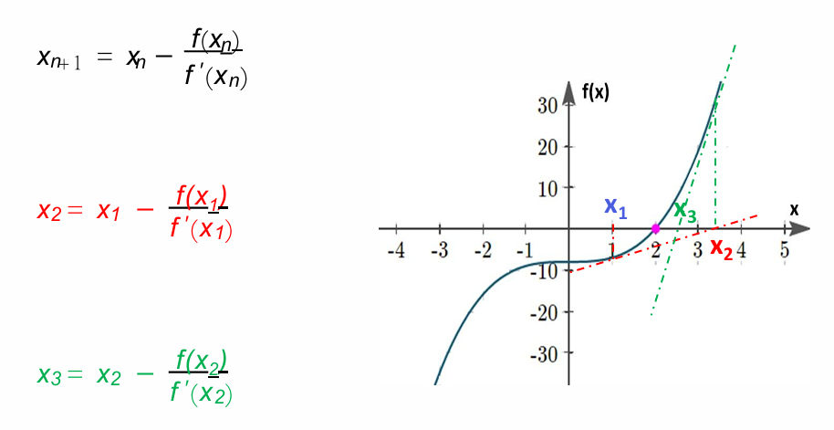


```python
import math

def dfdx(f, x, h=1e-3):
    return (f(x+h) - f(x)) / h

def newton(f, x0, tol=1e-6):  # 减小容差以提高精度
    d = abs(0 - f(x0))
    while d > tol:
        x0 = x0 - f(x0) / dfdx(f, x0)
        d = abs(0 - f(x0))
    return (x0, f(x0))

def f(x):
    return math.cos(x) + 2 + x**3 - 3*x

# 测试不同的初始值来找到两个根
root1, fx1 = newton(f, 1.0)   # 初始猜测1.0
root2, fx2 = newton(f, -1.5)  # 初始猜测-1.5
```

```python
import scipy.optimize
def f(x):
 return ...
scipy.optimize.newton( f,x0 )
```

## Lec17 - Py-Optimize: brute`

当我们想对群的每个子集进行分析时，使用组合。例如，要获得集合中的每一对：

```python
from itertools import combinations   #不考虑顺序，C42种
for pair in combinations( 'ABCD',2 ):
    print( pair )
#以元组形式输出

from itertools import combinations_with_replacements  #允许重复输出，不考虑顺序
```

```python
from itertools import permutations   #不允许重复输出，顺序有关，A42种
for triplet in permutations( 'ABCD',2 ):
    print( triplet )
```

```python
from itertools import product   #允许重复输出，顺序有关
for a,b in product( 'abc','ABC' ):
    print( a,b )
#相当于：
for a in 'abc':
    for b in 'ABC':
        print( a,b )
        
itertools.product(list,repeat=n)
 #n个list，每个list随机抽一个，得到m*n个元组，每个元组n个元素
```

`product` 对列表就是列表中的元素，对字符串就是字符串中的单个符号来遍历

## Lec18 - Optimize (找到可接受的解决方案（尽管不保证全局最优）)

**hill-climbing strategy 爬山算法(Greedy Algorithm 贪心算法)**

1. Set up a figure of merit `f`. （价值标准）
2. Select a starting guess `x0` (, `y0`, `z0`, etc.).
3. Change a feature of the guess (that is, push it in a certain direction).
4. If this improves the solution, then keep it and cycle back to step 3.
5. If no further improvement is possible, 结束模拟.

> [!ABSTRACT] 几类算法的特性
>
> 1. Brute-force search（暴力搜索/穷举法）：检查定义域内的**每一个**可能解，计算量大
> 2. Hill climbing（爬山算法）：这是一种迭代算法，从一个随机点开始，每次向邻近的、能让结果更好的方向移动一步；它依赖于**邻域搜索**，而不是从全局随机采样的子集中直接选最好的
> 3. 随机搜索（Random Search）：搜索空间（Domain）中随机地选取多个点，计算它们的目标函数值，然后从中选出表现最好的一个作为结果
> *”**stochastically sampled subset"**（随机采样的子集）“*

## Lec19 - Sympy-Algebra

`import sympy` or `import sympy as sy`

```python
#1
x = sympy.S( '2 * x + 3' )  #不是同一个x
3*x
>>> 6 * x + 9
#2
a = sympy.S( 'a' )
b = sympy.S( 'b' )
c = sympy.S( 'c' )
x = sympy.S( 'x' )   # a,b,c,x = sympy.S('a,b,c,x'）也可
eqn = a * x ** 2 + b * x + c
y = sympy.solve( a*x**2+b*x+c,x )
>>>y = [(-b + sqrt(-4*a*c + b**2))/(2*a), -(b + sqrt(-4*a*c + b**2))/(2*a)]

y[0].subs(a,1).subs(b,2).subs(c,1)
>>>-1

#3
sy.sqrt(8)
>>>2√2
```

`sy.init_printing()` 先运行，就会生成数学符号了
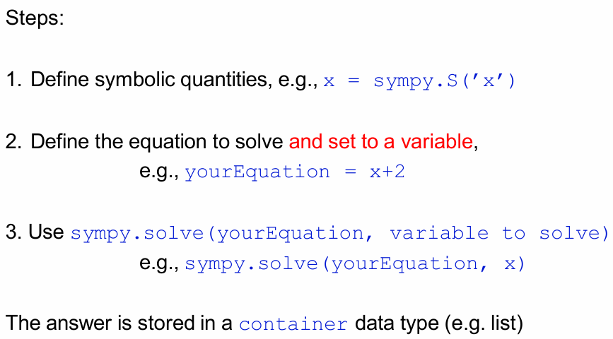

`sympy.I` is sqrt(-1) is j in python’s complex number
`sympy.re(z)`    复数z的实部
`sympy.im(z)`    复数z的虚部
`sympy.pi`
`sympy.E` is exp(1) = 2.718281828459...
`sympy.exp`, `sympy.log,` `sympy.sin` and others
`sympy.sqrt` and others

可以解多元方程组

```python
import sympy as sy 
x, y = sy.S( ’x, y’ )
eq1 = x + y - 6 
eq2 = - y + x + 4
z = sy.solve((eq1,eq2), (x, y))
>>>z = {x: 1, y: 5}
```

五次方程开始就解不出来了

```python
sympy.expand((x+1)*(x-1))  展开多项式

y = x**2+4*x+4 
sy.factor(y)  #因式分解
>>>(x+2)^2   #数学表达式

symsy.simplify((x**3 + x**2 - x - 1)/ (x**2 + 2*x + 1)) 
>>>x-1
```

> [!NOTE] SymPy 会自动保留简单的有理表达式

```python
import sympy as sy
x = sy.S( '2/120' )  
>>> 1/60  #数学表达式
```

**`sympy` 默认*不会*合并有理表达式和多项式**  `b/c+x/a`保持不变

`sympy.together( b/c+x/a )`
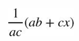

***math 和 sympy不能一起用***

`sympy.plotting.plot( x**2 [,(x,-2,2)])`
`sympy.plotting.plot3d( sympy.cos( x ) *sympy.sin( y ) )`
`plot3d_parametric_surface(x,y,z)`  曲面
`plot3d_parametric_line(x,y,z)`   曲线

## Lec20 - Sympy-Calculus

### 微分

```python
import sympy
sympy.init_printing()
x,y = sympy.S( 'x,y' )
sympy.diff( x**y,y )

>>>log(x)⋅x^y

sympy.diff( x**y,x,2 )   #求二阶导
```

### 积分

```python
import sympy
sympy.init_printing()
x = sympy.S( 'x' )
sympy.integrate( sympy.cos(x),(x,0,sympy.pi/2) )  #定积分在函数后有范围
                              ^ 这个括号很重要
>>>1
```

#### multiple integral

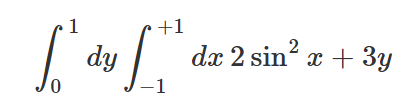
`sympy.integrate( sympy.integrate( 2*sympy.sin(x)**2+3*y,( x,-1,+1 ) ),( y,0,1 ) )`
不能用def的函数来替代

### Taylor Series
>
> [!NOTE] `sympy.series(f, x, x0, n[, dir='+'])`
> `f`: the function to expand
`x`: the variable
`x0`: the expansion point a (0 for Maclaurin series)
`n`: up to which order (n-1 terms will be shown)
`dir`: direction ('+' for right, '-' for left, default '+')

```python
import sympy
x = sympy.S( 'x' )
f = 1 / ( 1 - x )
sympy.series( f,x,0,4 )

>>>1+x+x**2+x**3+O(x**4)
```

### Linearization 保留泰勒展开的常数项和一次项

换句话说，*求切线*
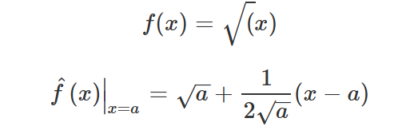

```python
f = sympy.sqrt( x )
fhat = sympy.series( f,x,a,2 )
fhat = fhat.removeO()   #是O不是0 ！
>>> sqrt(a) + (-a + x)/(2*sqrt(a))
```

`sympy.root(f,n) #f是函数，n是开几次根`
**expr是表达式**
`expr.sub(a,10) #表示a取10`  
`sympy.lambdity([a,b],expr)`

## Lec21-Modul

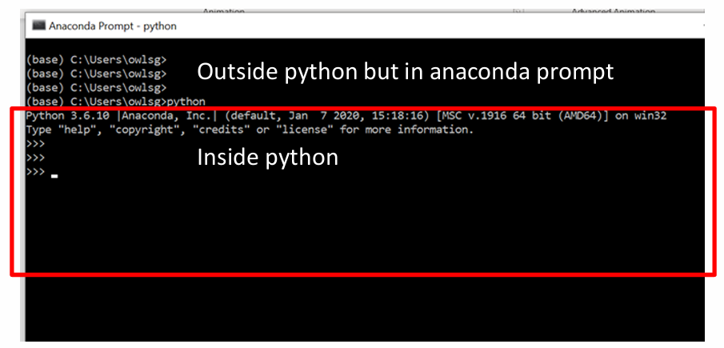

- 单个`>`是外部，可以选择python的版本
- `>>>`是特定python内部的环境

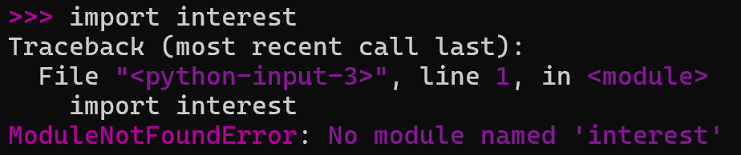

在**外部**环境输入：`conda list`  --> 查看已有的库（`pip list` 也可）

### 下载

`conda install XXX`   在联网情况下，从服务器下载特定库 (`pip install XXX` 也可)

### 更新

`conda upgrade XXX`
`pip install --upgrade XXX`
*chose `[y]/n`*

### 删除

`conda remove XXX`
`pip uninstall XXX`

### 创建自己的库

在**记事本**里输入代码，然后把后缀改为 `.py`
代码里是这个库包含的（定义的）函数
记事本名称是库名称 `interest.py`     说明自己创建的库叫`interest`

### 创建库的位置

1. Put your module file in the same folder as your own program (Easiest).
2. tell Python where to find our module

- Place the module file in one of the folders in `sys.path`

```python
import sys, pprint 
pprint.pprint(sys.path)
```

***存在下面的路径中***
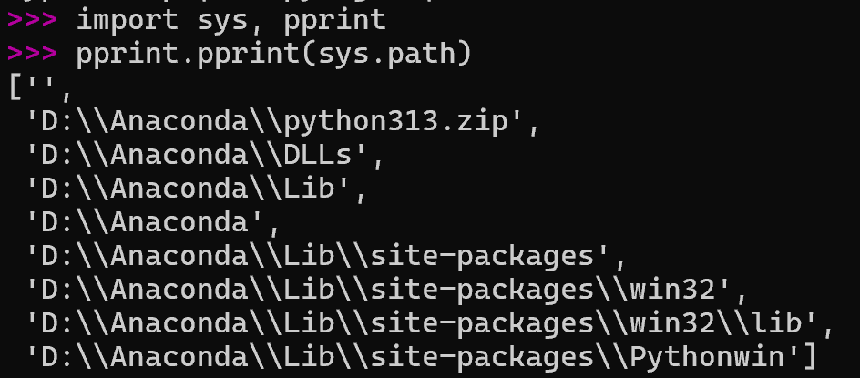

> [!NOTE] You are saving your module on your computer not on some internet computer!

### 更多的库

1. `Pandas`—Python for Data Analysis
2. `Scikit-Learn` or `pyTorch` —machine learning
3. `Classes` (object-oriented programming)
4. `Bokeh`—interactive plots, like web graphics

# Matlab

# MATLAB 入门之旅摘要

## 基本语法

|示例|说明|
|---|---|
|[`x = pi`](https://www.mathworks.com/help/matlab/matlab_env/create-and-edit-variables.html)|使用等号 (`=`) 创建变量。  <br>左侧 (`x`) 是变量的名称，其值为右侧 (`pi`) 的值。|
|[`y = sin(-5)`](https://www.mathworks.com/help/matlab/learn_matlab/calling-functions.html)|您可以使用括号提供函数的输入。|

## 桌面管理

|函数|示例|说明|
|---|---|---|
|[`save`](https://www.mathworks.com/help/matlab/ref/save.html)|`save data.mat`|将当前工作区保存到 MAT 文件中。|
|[`load`](https://www.mathworks.com/help/matlab/ref/load.html)|`load data.mat`|将 MAT 文件中的变量加载到工作区。|
|[`clear`](https://www.mathworks.com/help/matlab/ref/clear.html)|`clear`|清除工作区中的所有变量。|
|[`clc`](https://www.mathworks.com/help/matlab/ref/clc.html)|`clc`|清除命令行窗口中的所有文本。|
|[`format`](https://www.mathworks.com/help/matlab/ref/format.html)|`format long`|更改数值输出的显示方式。|

## 数组类型

|示例|说明|
|---|---|
|`4`|标量|
|`[3 5]`|行向量|
|`[1;3]`|列向量|
|`[3 4 5;6 7 8]`|矩阵|

## 等间距向量

| 示例                 | 说明                                                                                                         |
| ------------------ | ---------------------------------------------------------------------------------------------------------- |
| `1:4`              | 使用[冒号 (`:`)](https://www.mathworks.com/help/matlab/ref/double.colon.html) 运算符，创建一个从 `1` 到 `4`，间距为 `1` 的向量。 |
| `1:0.5:4`          | 创建一个从 `1` 到 `4`，间距为 `0.5` 的向量。                                                                             |
| `linspace(1,10,5)` | 创建一个包含 `5` 个元素的向量。这些值从 `1` 到 `10` 均匀间隔。                                                                    |
|                    |                                                                                                            |

## 创建矩阵

| 示例           | 说明                     |
| ------------ | ---------------------- |
| `rand(2)`    | 创建一个 `2` 行 `2` 列的方阵。   |
| `zeros(2,3)` | 创建一个 `2` 行 `3` 列的矩形矩阵。 |

## 索引

| 示例          | 说明                   |
| ----------- | -------------------- |
| `A(end,2)`  | 访问最后一行的第二列中的元素。      |
| `A(2,:)`    | 访问第二行所有元素。           |
| `A(1:3,:)`  | 访问前三行的所有列。           |
| `A(2) = 11` | 将数组中第二个元素的值更改为 `11`。 |

## 数组运算

| 示例                                                             | 说明                                                                                                      |
| -------------------------------------------------------------- | ------------------------------------------------------------------------------------------------------- |
| `[1 1; 1 1]*[2 2;2 2]`<br>ans =<br>     4    4<br>     4    4  | 执行[矩阵乘法](https://www.mathworks.com/help/matlab/matlab_prog/array-vs-matrix-operations.html#btyv9yp-4)。  |
| `[1 1; 1 1].*[2 2;2 2]`<br>ans =<br>     2    2<br>     2    2 | 执行[按元素乘法](https://www.mathworks.com/help/matlab/matlab_prog/array-vs-matrix-operations.html#bu90xxy-1)。 |

## 多个输出

| 示例                      | 说明                      |
| ----------------------- | ----------------------- |
| `[xrow,xcol] = size(x)` | 将 `x` 中的行数和列数保存为两个不同变量。 |
| `[xMax,idx] = max(x)`   | 计算 `x` 的最大值及其对应的索引值。    |

## 文档

| 示例          | 说明                 |
| ----------- | ------------------ |
| `doc randi` | 打开 `randi` 函数的文档页。 |

## 绘图

| 示例                              | 说明                                               |
| ------------------------------- | ------------------------------------------------ |
| `plot(x,y,"ro-","LineWidth",5)` | 绘制一条红色 (`r`) 虚线 (`--`)  <br>并使用圆圈 (`o`) 标记，线宽很大。 |
| `hold on`                       | 在现有绘图中新增一行。                                      |
| `hold off`                      | 为下一个绘图线条创建一个新坐标区。                                |
| `title("My Title")`             | 为绘图添加标签。                                         |

## 使用表

| 示例                                            | 说明                             |
| --------------------------------------------- | ------------------------------ |
| `data.HeightYards                             | 从表 `data` 中提取变量 `HeightYards`。 |
| `data.HeightMeters = data.HeightYards*0.9144` | 从现有数据中派生一个表变量。                 |

## 逻辑运算

| 示例               | 说明                            |
| ---------------- | ----------------------------- |
| `[5 10 15] > 12` | 将向量与值 `12` 进行比较。              |
| `v1(v1 > 6)`     | 提取 `v1` 中大于 `6` 的所有元素。        |
| `x(x==999) = 1`  | 用值 `1` 替换 `x` 中等于 `999` 的所有值。 |

## 编程

| 示例                                                                                                       | 说明                                                                     |
| -------------------------------------------------------------------------------------------------------- | ---------------------------------------------------------------------- |
| [if](https://www.mathworks.com/help/matlab/ref/if.html) x > 0.5<br>    y = 3<br>else<br>    y = 4<br>end | 如果 `x` 大于 `0.5`，则将 `y` 的值设置为 `3`。  <br>  <br>否则，将 `y` 的值设置为 `4`。       |
| [for](https://www.mathworks.com/help/matlab/ref/for.html) c = 1:3<br>    disp(c)<br>end                  | 循环计数器 (`c`) 遍历  <br>值 `1:3`（`1`、`2` 和 `3`）。  <br>  <br>循环体显示 `c` 的每个值。 |
