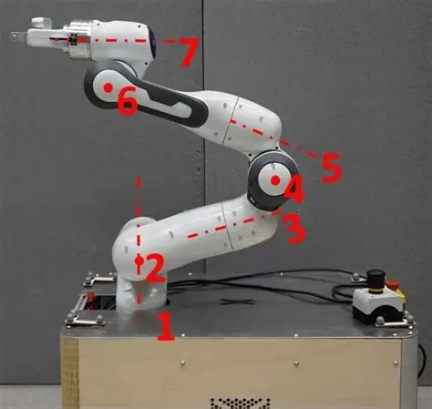

# Franka 臂 (Franka Emika Panda)

Franka 臂，全名Franka Emika Panda，是一台非常经典的**7轴机械臂**
> [!question] 为什么强调是7轴呢？
> 因为人类的手臂（包含肩膀、手肘、手腕的各个旋转方向）加起来刚好大约有7个运动自由度，所以 Franka 臂动起来非常灵活，姿态很像人类的胳膊
> { width="377" }
- 因为它灵敏且好用，全球很多顶级的人工智能实验室都默认买这台机器来作为测试 AI 算法的“身体”