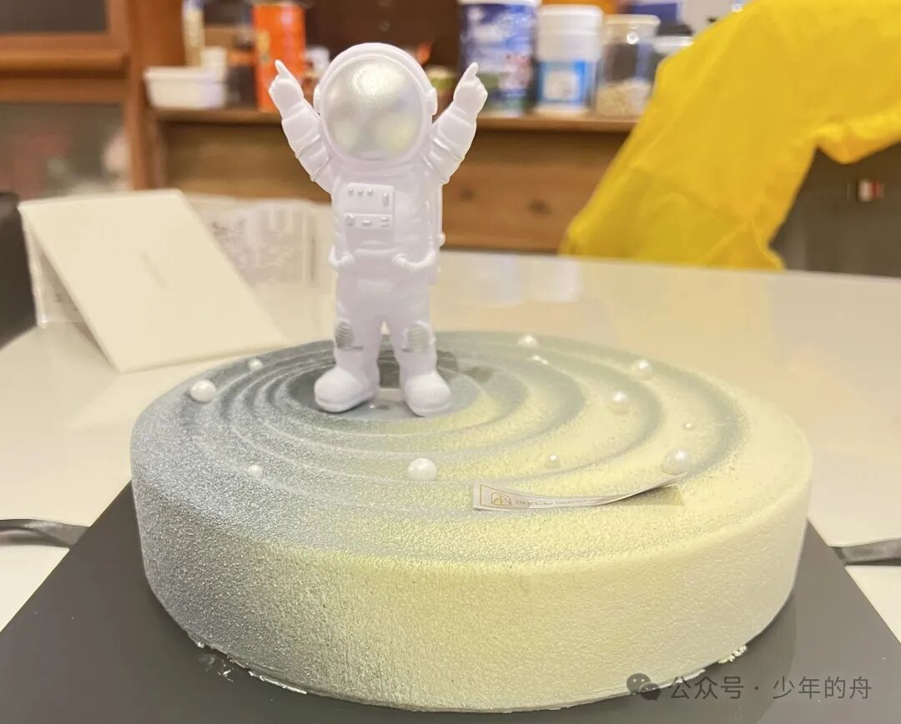
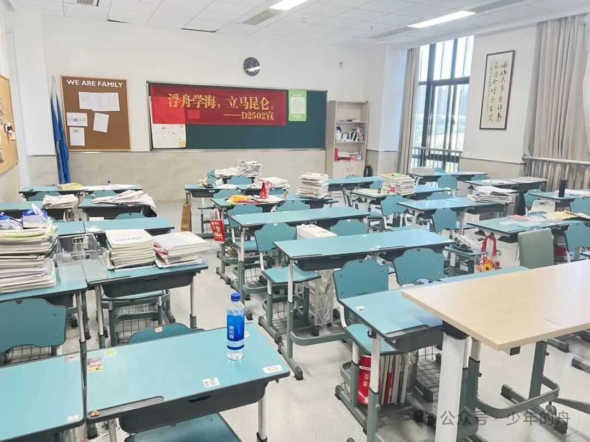
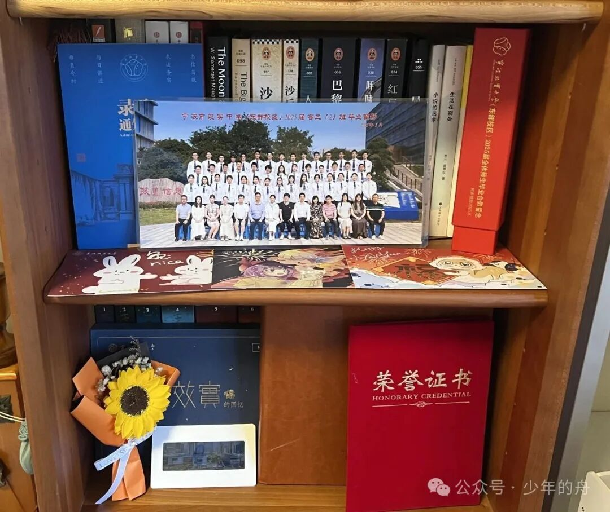
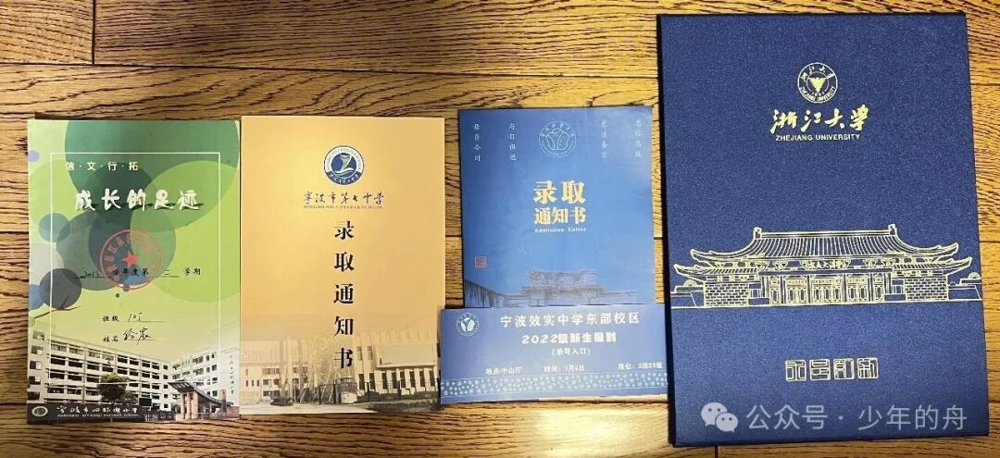
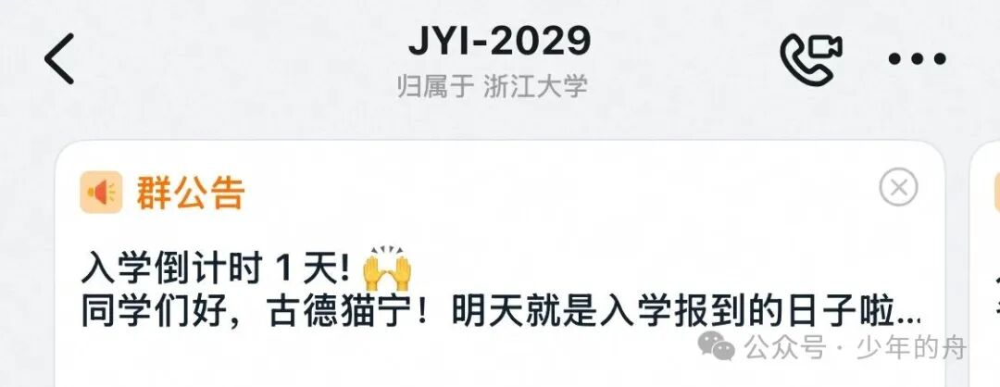
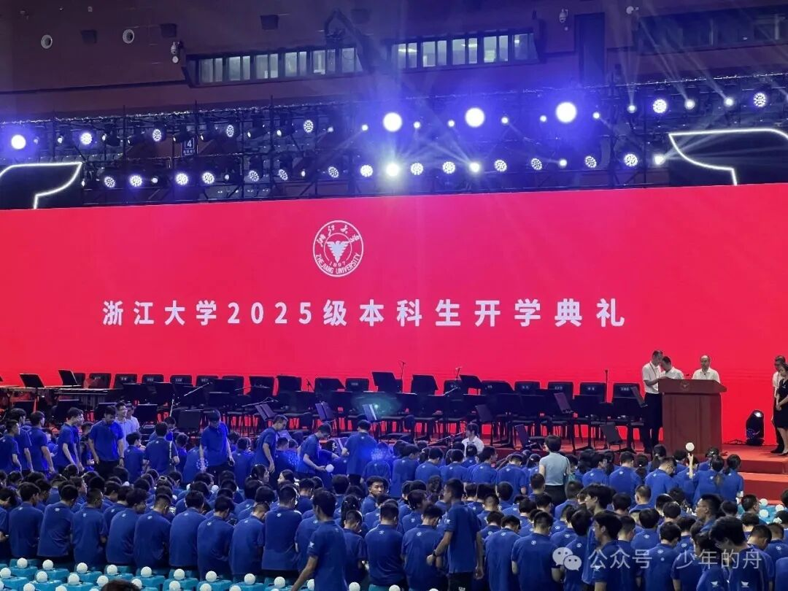
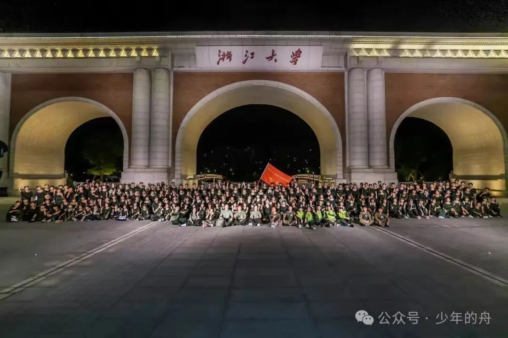
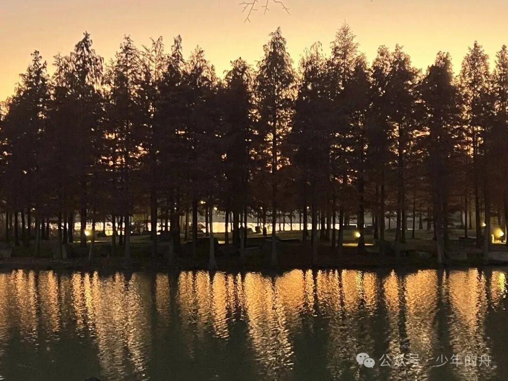

2025年，就这么润物细无声地结束了。

农历来算的话，2025年开始于**首考出分**。还记得那时候，自己看到那样的成绩，不甘中透露着不知所措，不知所措中裹挟着释然。毕竟本来就不擅长七选三，首考没有作出什么成绩也是早有预料。唯一记得的就是自己默默停掉了本来计划寒假上的复交三一培训，回去学语文数学（）

我不能说这个制度优劣如何，现在说也没有意义（反倒是大学外省同学字里行间都是对首考的殷切歌颂）。现在回忆起来只觉得那时候被这个成绩桎梏了好久，那时候看着班里面有同学好多自习课，就觉得首考实在是杀人诛心，眼睁睁看着本来就比自己优秀的同学有更多的进步空间，羡慕便油然而生。虽然不会刻意去想，但是话里话外都是一种透过一月看六月的恍惚感，仿佛就连后来的努力也变得可怜了几分。

从二月份到五月份，真的一眨眼的事。Z20、新阵地、二模把这几个月拆成了一段段计划表。回想那时候，早上看到第一节是选三，开开心心地去图书馆补觉，又或是背英语语料。下午下课去图书馆，和同学们抢位置，然后准备吃饭的时候招呼来招呼去的“连带反应”，倒是亲切了几分：好像写这篇总结的时候都会有人走到我旁边来叫我去吃晚饭似的。

这中间唯一印象深刻的就是18岁生日了。二模第一天的生日，考试考的哭笑不得，然后回去过成人礼。没有鲜花、没有庆祝，但是有一个蛋糕，爸爸妈妈写的贺卡和亲人们送的礼物。质朴而动人。尽管第二天还有三门考试就是了:(

每个周五晚，还有英语补习班。和三三两两的同学从班会课溜出来，互相嚷着占座位，然后在地铁上发表对未来的看法（以及被骂说首考续写写偏、不可能三个一样答案的这个能被唠一辈子）。

那时候自己的世界还太小太小，小到人生好像只有高考，好像只能透过高考看世界。这种局限感并不是束缚，只能说是在那个关头，人生节点将要到来，狭隘认知在舒适圈的主动封闭吧？**当时跳不出，现在也回不去了**。现在想想，那种“愚”和短浅又何尝不是某种幸福呢？——我们能考虑的只有高考，也只有高考。加缪那句话怎么说来着？

> 我们必须想象西西弗斯是幸福的。

**因为这是西西弗斯与命运和解的唯一方式；也是我们与那段仓促又哭笑不得的青春和解的唯一方式。**

然后，高考到来了。考语文数学前，可能是心理原因导致生理不适，在化学办公室和H老师畅聊了很久。仍然记得考语文的时候，第一眼看到语文作文的震惊以及看到种树非联文本的诧异；考数学的时候过山车一样的心情；考英语走错考场、极限听力的红温和考化学二十分钟配平方程式的绝望。数学考完之后我就知道折大的三一我是必去不可了，当然了也幸亏面试的超绝高分让我免受80个志愿的“家庭矛盾trigger”荼毒（）

     
真的很感谢效实的老师大家庭，让我有了新的心态和视角去面对我的人生。在困于挫折的时候，在得志的时候，在规划的时候，给了我那么多的支持！

 夏天是多么奇妙的季节呢？2025的这个夏天，好像果真如我们班歌《玻璃夏天》那般纯净透明而梦幻，又那般**易碎**。我清楚的知道，高中有些同学这一辈子都见不到了，就像初中那样，就像小学那样。大家各奔东西，但是被*效实胚子*这个tag又联系在一起。效实很好，无论是中考那会，还是上大学以后和全国各地的同学交流，效实都是我心中**No.1**的高中。
（当然了，也是希望效实的招牌和特色不要被大环境带坏，我知道这个没有对错，但还是希望届届传下来的校风可以得以延续）

“人生到处知何似，应似飞鸿踏雪泥。” 然后是暑假，一个期盼了无数年的暑假。之前听到“盛夏蝉鸣”的比喻，就觉得有过之而不不及。真的身处之时，反倒有种拔剑四顾心茫然之感。回小学初中看老师、学聚会、旅游、看球赛、学习视频剪辑和无人机等等，好像要把之前所有探索世界的念头全部实现，然后就发现自己还是懒，本质还是p人，想到啥做啥。其实只想睡觉了。

接着，怀着忐忑更多是期待的心情，大学生活从军训拉开了帷幕。最大的感想？好多人啊。从全国各地考过来的同学们，完全不同的口音、地方特色，却都追求进一步的学业进步。导员人很好，军训的时候也遇到了一群可以嬉笑打闹，再后来关系很好的同学们。

要说最有感触的一幕，必须是军训合唱了吧。说实话很久很久没有这样振奋人心的时候了。从声部的选拔到校歌和《纪念》的连夜学习，从排练到十一点多才回寝，第二天六点多起床，到三个声部的不断微调，为了连队的荣誉，大家都拼上了半条命。当结果并不如意的时候，在愤愤不平的同时，我们为了更加纯粹的呈现和展示而守护了初心，我永远也忘不了唱到B4的时候，小林学长和旁听老师偷偷抹眼泪的瞬间。纯粹的团结和拼劲，我什么时候才能不为之湿润眼眶呢？（具体见视频号）

9月到12月，大学生活和学习真正地开始了。这到底是不是我曾经憧憬过的大学生活呢？我有些记不清了。“大学比高中更轻松”倒是彻底被证明成了一句迷惑高中生的咒语。（好想回效东休息几天）全英文环境的教学和联合培养的课程计划毫无疑问是适合我的，不是说我英语有多好，只是这样EMI的环境让我更想学习英语作为第二语言去使用，去沟通，去联系。学习英语，融英语到生活，用英文沟通的感觉很好。不是为了感觉让自己举止像个留子strong哥，而是这种**能够和更多人交流的能力**让我很安心。我想这也是国际联合学院的初心之一吧，我很认可。

如果要说大学生活和以前的生活有什么区别的话，我想恋爱的经历是很关键的一点。对于没谈过恋爱的我来说，能够对恋爱祛魅是我的第一想法。无论怎么说，我都需要**学会怎么去爱一个人**，而这不是看看纯爱番就能学会的，需要你有**真诚的感情和认真的态度**。虽然我知道爱情这个事是*顺其自然*，但是也不能因为没有谈过恋爱就*畏手畏脚、不抓住机会*。这绝不是说和谁谈都可以，更不是说自己把恋爱当做一种用之即弃的用品。相反，恋爱对于尤其进入大学生活、半步踏入社会的学生来说，更像是一种**多维的支持和依靠**。

就拿我个人的恋爱价值观来说，谈恋爱必须要是**双方能够越来越好**的基础之上进行的关系，理想的情况是一种**稳定的陪伴和对对方进步的保障、支持**。这也是和Elysia互诉心意后，我提出并且由双方始终坚守的恋爱核心观。我们想要的都不是在矛盾爆发后的冷战和指责，而是在***深度沟通(Deeptalk)*** 后能够更加了解对方想法并且共同找出解决方案的进一步融洽机制。俗话说不打不相识，矛盾的产生也就意味着维护和进步的空间，这是从认识到再认识的良性循环。至今为止，我很高兴地看到我和Elysia无论是对这段感情的态度也好，个人的缺陷也好，对对方的了解和磨合也好，都在向着越来越好的方向发展。这让我很有成就感，也给了我前进的底气。**That's called spiral.**

再说回大学生活，我不得不发表一下对大学神人的评价。怎么说呢，“林子大了什么鸟都有”这句话简直不要太对。可能是老天爷眷顾吧，和神人们的接触并非必要。其实三观或价值观不合的同学也有见到过，个人意见是乐子人哪里都有，顺其自然，主动远离。物以类聚，人以群分。

其实对我而言，从高中到大学的转换并没有那么平滑。看似从高中的追求分数、排名到大学的追求高绩点和保研、出国，就考试而言没有太大差别。然而更加**多元化和多维度的考察模式**确实需要适应。考试变为了各个方面的考核，presentation、平时分、身体素质、社会实践、竞赛和科研。大家为了交出一个“优质简历”而拼命在简历的各个栏目中添砖加瓦，要更全面，要更开朗健谈，要更自律，要有更多人脉和资源。

正因为如此，大学之间的竞争变得更加扑朔迷离。我们不再能够通过一个所谓的总分来判断自己成果，也无法从排名来判断自己的学习状态和进步。绩点反映的排名能够决定我们专业的学习成果，但是这并不是全部，只是一个基础。所以步入大学，除了传统绩点排名的比较之外，参考标准开始向不确定性更强的不断变化的评价指标和学术能力代替，这样一来他人能够提供的参考价值就变得很难以捉摸。

你不知道ta参加这个比赛，学习这个技能，哪怕是参与这个社会实践，是不是于你而言所需要的。尽管你对自己的生涯已经有了一定的规划，但是当曾经必须学会的“解题技巧”变为optional，必须要在**无以计数的选择中作出取舍**时，**如何从他人的选择中找出价值**，这就是大学到社会很重要的一课，也是我在2026年需要学好的一课。

这一年，看的书没有那么多了，可能是上半年语料背吐了。文学性的高强度输入有了一些阴影？26年差不多缓过来了，还是要多输入，多阅读经典，否则有些场景出现都不知道用什么样的文字去表达，用什么样的思维去处理这些事情。

去年大年初一的年终总结中，我说：

> 2025这一年，将会承载太多太多的意义，它将见证一段青春的结束，又会见证一段青春的开幕。

我没法评判这两段青春的价值。一段已经封存，将会成为越来越醇香的美酒，在偶尔的回望中从缝隙里散发无法复刻的馥郁；一段正逢开篇，从前方吹来的是裹挟着不确定性的晨风。我知道的是，我会为了心中理想的某些场面去奋斗，去拼搏，去争取，让自己不留下遗憾。

 **“少年没有乌托邦，心向前方自明郎。”**

2025年，总结了几点感悟：

1.做什么事都要有自己的**节奏**，尤其到了大学和社会中，别人的参考不是底线，只是**选择**。

2.不要过度放大自己没有的东西，忽视自己已经有的东西。无论成就也好，风格也罢，成为更优秀的人不是复制粘贴别人的源代码。尤其是到了强者云集的环境中，取长补短提升自己的同时必须要坚守一些根本。

3.***要做一个值得别人尊敬的人。***

4.无意义的焦虑往往发生在**停滞不前**和**过度比较**，这样很容易陷入恶性循环。给自己喘息的机会，想想自己究竟要做什么，清晰的计划不一定要拿来严格执行，但是让自己清楚该去往何方。

5.**自律**和**执行力**将会决定一切。你已经知道怎么样成就一个更好的自己了，不是吗？

6.到了大学，能用绝对实力解决的事情在逐渐变少。*人脉资源，处世哲学，认知管理*等等不可或缺。

这个世界很小，小到足不出户就能看到地球村；这个世界又很大，大到每往外走一点就会有全新的感触。现在我有不顾一切尝试和犯错的底气，有一定的规划和支撑我的资源，有走在世界学术和领域前沿的机会，大可以尝试自己想尝试的，收获自己想收获的。但一切的基础在于“走出去”，走出舒适圈，走出被限制的束缚，到真正能够见识到世界的地方去，攀登到山顶去看看自己能为这个世界做些什么，这个世界的哪个领域真正适合我——

***"Be Global. Be Active."***
